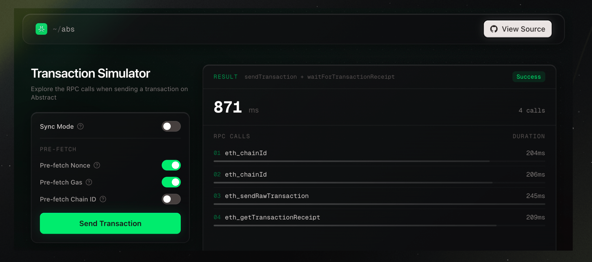

# Transaction Simulator

Visualize every RPC call that happens when you send a transaction on [Abstract](https://abs.xyz). See exactly what goes over the wire, how long each call takes, and how different optimizations affect total transaction time.

**[Try it live](https://abs.txsim.com)**

## What it does

When you send a transaction through a wallet client like [viem](https://viem.sh), several RPC calls happen under the hood: fetching the nonce, estimating gas, getting the chain ID, sending the raw transaction, and polling for the receipt. This tool instruments the transport layer to capture and display every one of those calls in real time.

The result panel shows a waterfall view of each RPC method, its duration, and the total time from send to confirmation.

## Optimizations

Toggle these options to see how they affect the RPC trace:

| Option | What it does |
|--------|-------------|
| **Sync Mode** | Uses `eth_sendRawTransactionSync` to send and confirm in a single RPC call instead of polling for the receipt |
| **Pre-fetch Nonce** | Fetches the account nonce before the timed run so `eth_getTransactionCount` doesn't appear in the trace |
| **Pre-fetch Gas** | Pre-fetches gas estimate, base fee, and priority fee before the timed run |
| **Pre-fetch Chain ID** | Caches the chain ID locally so `eth_chainId` resolves instantly without an RPC round-trip |

With all optimizations enabled + sync mode, a transaction can confirm in a single RPC call.

## How it works

1. A fresh private key is generated for each run
2. A custom viem [transport](lib/instrumented-transport.ts) wraps every RPC request to log method name, start time, and duration
3. The transaction sends 0 ETH to the zero address using Abstract's native paymaster (no funds needed)
4. RPC calls stream into the UI as they happen, with a live elapsed timer
5. On completion, the full waterfall and total duration are displayed

## Running locally

```bash
pnpm install
pnpm dev
```

Open [http://localhost:3000](http://localhost:3000).

## Stack

- [Next.js 16](https://nextjs.org) + React 19
- [viem](https://viem.sh) for wallet/public clients and transport instrumentation
- [Tailwind CSS v4](https://tailwindcss.com)
- Abstract Testnet RPC + native paymaster
